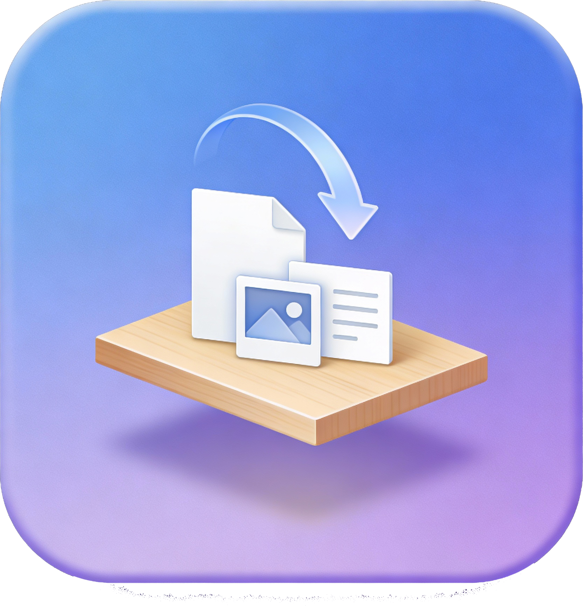

<div align="center">



# Easier Drop

**El estante de "arrastrar y soltar" que faltaba en macOS.**

[🇺🇸 English](README.md) | [🇧🇷 Português](README_pt.md) | [🇪🇸 Español](README_es.md)

[](https://opensource.org/licenses/MIT)
[](https://www.apple.com/macos/)
[](https://dart.dev)
[](https://flutter.dev)

</div>

---

## 🚀 Visión General

**Easier Drop** es una utilidad nativa para macOS que actúa como un estante temporal para tus archivos.

Deja de arrastrar archivos uno por uno entre aplicaciones a pantalla completa. **Easier Drop** te permite "guardar" archivos desde cualquier lugar (Finder, Safari, Fotos) y reunirlos en un estante flotante. Cuando estés listo, toma toda la pila y suéltala en tu destino de *una sola vez*.

<div align="center">
  <video src="assets/promo/useged.mov" controls="controls" muted="muted" style="max-width: 100%;"></video>
  <br>
  <i>(Mira el video de demostración en <code>assets/promo/useged.mov</code> si no carga)</i>
</div>

> **Nota**: Una alternativa gratuita y de código abierto a herramientas como Dropover.

## ✨ Características


- **📦 Recolecta en cualquier lugar**: Arrastra texto, imágenes o archivos desde cualquier app al estante.
- **📂 Acción masiva**: Mueve o copia todos los elementos recolectados a un destino en un solo arrastre.
- **⚡️ Rápido y Nativo**: Creado con Flutter y macOS UI para una apariencia nativa del sistema.
- **🖥️ Siempre visible**: Flota sobre otras ventanas para estar siempre accesible.
- **🧹 Auto-Limpieza**: Limpia los archivos automáticamente después de arrastrarlos fuera.
- **⌨️ Atajos**:
  - `Cmd+Backspace`: Limpiar estante
  - `Cmd+C`: Copiar elementos
  - `Cmd+Shift+C`: Compartir elementos
- **🌗 Modo Oscuro**: Soporta totalmente la apariencia del sistema macOS (claro/oscuro).

## 🛠 Instalación

### Descargar App
[**Descargar Última Versión**](https://github.com/victorcmarinho/easier_drop/releases)

### Desde el Código Fuente

1. **Requisitos**: [Flutter SDK](https://flutter.dev) instalado.
2. **Clonar y Ejecutar**:
   ```bash
   git clone https://github.com/victorcmarinho/easier_drop.git
   cd easier_drop
   flutter pub get
   flutter run -d macos
   ```

## 🎮 Cómo funciona

<div align="center">
  
</div>

1. **Arrastra** archivos desde Finder o Navegadores.
2. **Suelta** en la ventana flotante.
3. **Navega** hasta tu destino.
4. **Arrastra** la pila hacia afuera.

## 🤝 Contribuyendo

¡Las contribuciones son bienvenidas!
1. Haz un Fork del Proyecto
2. Crea tu Rama de Funcionalidad (Feature Branch)
3. Envía un Pull Request

## 📄 Licencia

Distribuido bajo la Licencia MIT. Ver `LICENSE` para más información.

## ❤️ Soporte

<div align="center">
  <a href="https://github.com/sponsors/victorcmarinho">
    
  </a>
</div>
