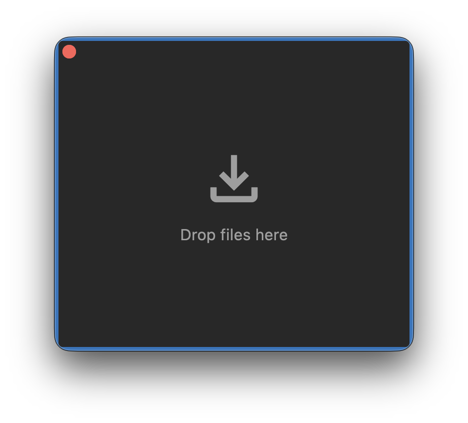

<div align="center">


# Easier Drop

**A prateleira de "arrastar e soltar" que faltava no macOS.**

[🇺🇸 English](README.md) | [🇧🇷 Português](README_pt.md) | [🇪🇸 Español](README_es.md)

[](https://opensource.org/licenses/MIT)
[](https://www.apple.com/macos/)
[](https://dart.dev)
[](https://flutter.dev)

</div>

---

## 🚀 Visão Geral

**Easier Drop** é um utilitário nativo para macOS que atua como uma estante temporária para seus arquivos.

Pare de arrastar arquivos um por um entre aplicativos em tela cheia. O **Easier Drop** permite que você "guarde" arquivos de qualquer lugar — Finder, Safari, Fotos — e os reúna em uma estante flutuante. Quando estiver pronto, pegue a pilha inteira e solte no seu destino de *uma só vez*.

<div align="center">
  
  <br>
  <i>(Veja o GIF de demonstração em <code>assets/promo/useged.gif</code> se não carregar)</i>
</div>

> **Nota**: Uma alternativa gratuita e open-source a ferramentas como o Dropover.

## ✨ Funcionalidades



- **📦 Colete de Qualquer Lugar**: Arraste texto, imagens ou arquivos de qualquer app para a estante.
- **📂 Ação em Massa**: Mova ou copie todos os itens coletados para um destino em um único arrasto.
- **⚡️ Rápido & Nativo**: Desenvolvido com Flutter & macOS UI para uma aparência nativa do sistema.
- **🖥️ Sempre no Topo**: Flutua sobre outras janelas para estar sempre acessível.
- **🧹 Limpeza Automática**: Limpa os arquivos automaticamente arrastá-los para fora.
- **⌨️ Atalhos**:
  - `Cmd+Backspace`: Limpar estante
  - `Cmd+C`: Copiar itens
  - `Cmd+Shift+C`: Compartilhar itens
- **🌗 Modo Escuro**: Suporta totalmente a aparência do sistema macOS (claro/escuro).

## 🛠 Instalação

### Baixar App
[**Baixar Última Versão**](https://github.com/victorcmarinho/easier_drop/releases)

### Do Código Fonte

1. **Pré-requisitos**: [Flutter SDK](https://flutter.dev) instalado.
2. **Clonar e Rodar**:
   ```bash
   git clone https://github.com/victorcmarinho/easier_drop.git
   cd easier_drop
   flutter pub get
   flutter run -d macos
   ```

## 🎮 Como funciona

<div align="center">
  
</div>

1. **Arraste** arquivos do Finder ou Navegadores.
2. **Solte** na janela flutuante.
3. **Navegue** até o seu destino.
4. **Arraste** a pilha para fora.

## 🤝 Contribuição

Contribuições são bem-vindas!
1. Faça um Fork do Projeto
2. Crie sua Feature Branch
3. Envie um Pull Request

## 📄 Licença

Distribuído sob a Licença MIT. Veja `LICENSE` para mais informações.

## ❤️ Suporte

<div align="center">
  <a href="https://github.com/sponsors/victorcmarinho">
    
  </a>
</div>
