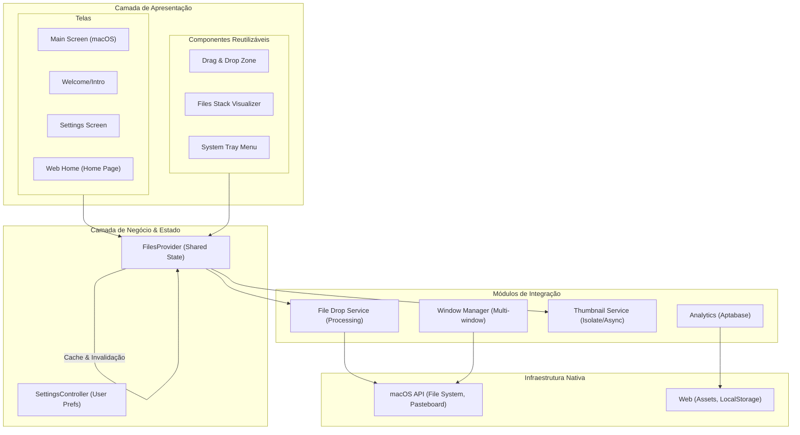
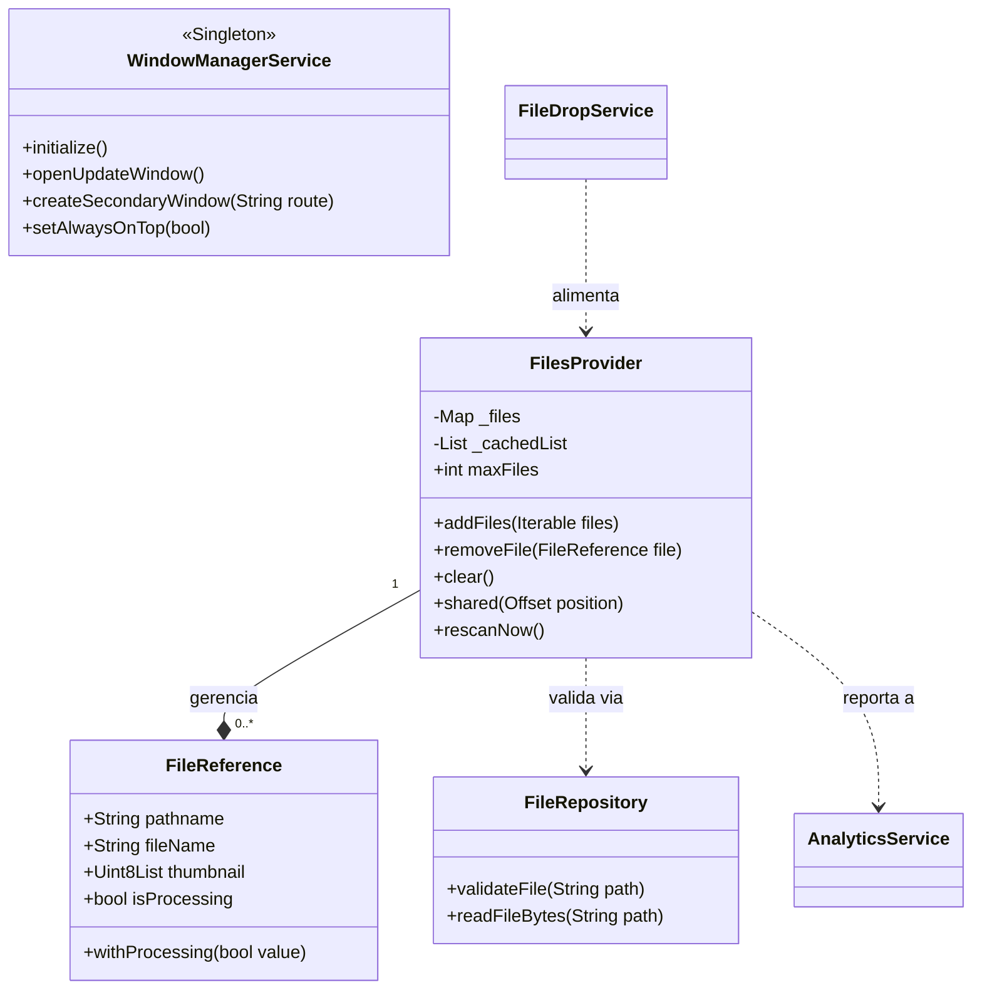
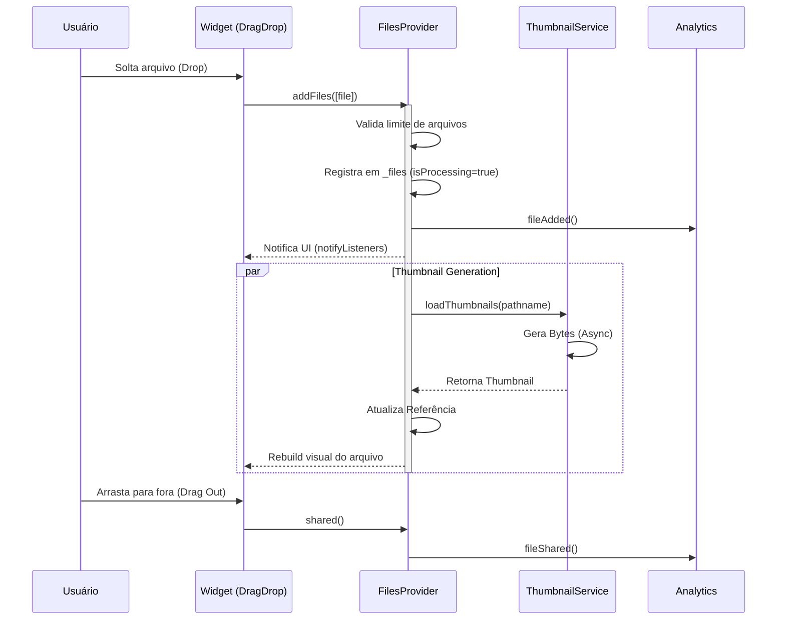
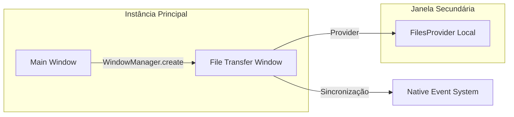
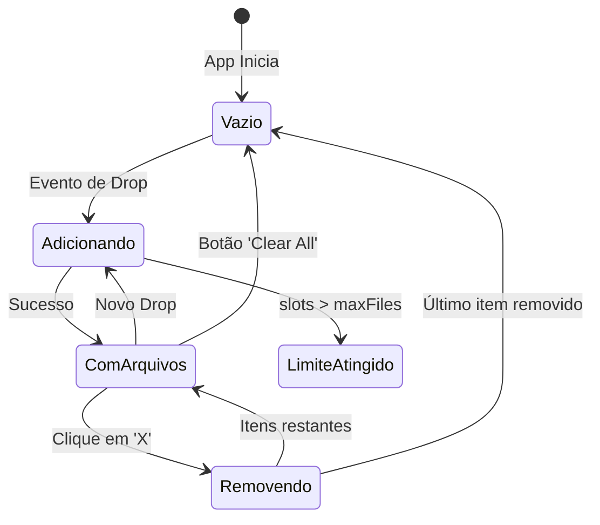

# Arquitetura Detalhada e Fluxos do Projeto

O Easier Drop utiliza uma arquitetura reativa e modular, otimizada para performance em ambiente desktop e web. Esta documentação detalha a interação entre os componentes e o ciclo de vida dos dados.

## 1. Visão de Camadas (Nível 2)
Uma visão mais profunda das responsabilidades de cada módulo.

## 2. Diagrama de Classes Detalhado
Foco nos principais atributos e métodos que orquestram a aplicação.

## 3. Fluxo de Vida do Arquivo (Sequence Diagram)
O caminho de um arquivo desde o "Drop" do usuário até o "Drag Out".

## 4. Gestão de Janelas Secundárias
Como o app lida com múltiplas instâncias para transferência simultitânea.

## 5. Estados da Coleção de Arquivos
O `FilesProvider` transita entre diferentes estados baseados na interação.

## Fluxo de Operação: "Drop & Drag"
1. **Captura**: O componente `DragDrop` intercepta o evento nativo do sistema operacional.
2. **Validação**: O `FileRepository` verifica se o arquivo ainda existe e se é acessível.
3. **Estado Reativo**: O `FilesProvider` gerencia um mapa único por caminho (pathname) para evitar duplicidade.
4. **Otimização**: Thumbnails são gerados sob demanda e cacheados em memória para garantir scroll fluido na stack de arquivos.
5. **Saída**: O envio (`Drag Out`) utiliza o protocolo nativo via `share_plus` ou APIs de drag nativas do macOS.
