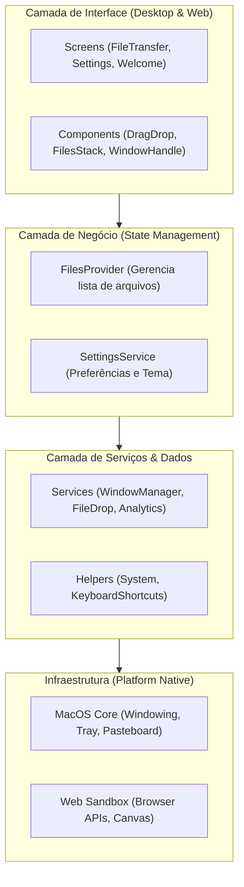
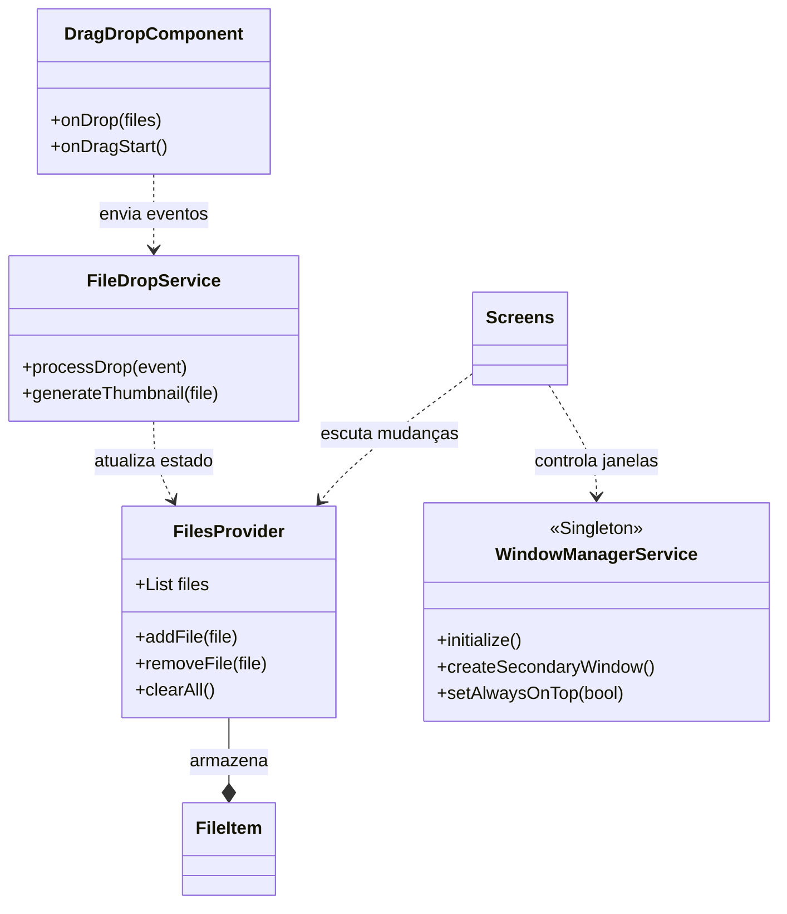

# Arquitetura e Fluxo de Dados

A arquitetura do Easier Drop é baseada no padrão **Clean Architecture** (Simplificado) com o uso de **Providers** para gerenciamento de estado.

## Diagramas de Arquitetura

### 1. Visão Geral das Camadas
O Easier Drop organiza-se em camadas para garantir que a interface seja separada da lógica de sistema e estado.

### 2. Diagrama de Relacionamentos
Este diagrama detalha como os principais componentes interagem durante o ciclo de vida de um arquivo.

## Fluxo de Operação: "Drop & Drag"

1. **Evento de Drop**: O usuário solta um arquivo na zona de captura (`lib/components/drag_drop.dart`).
2. **Serviço de Arquivo**: O `FileDropService` processa o arquivo e extrai metadados/thumbnails.
3. **Atualização de Estado**: O `FilesProvider` é notificado e atualiza a lista de arquivos em memória.
4. **Rebuild da UI**: O `FilesStack` e outros componentes inscritos no `FilesProvider` são reconstruídos automaticamente.
5. **Evento de Drag Out**: O usuário arrasta o lote final da aplicação. O `DragOutService` prepara o payload para o sistema operacional.

## Padrões Adotados
- **Singleton**: Utilizado em `Services` (ex: `AnalyticsService.instance`) para garantir instância única em toda a vida útil da aplicação.
- **Repository Pattern**: O `FileRepository` abstrai a forma como os dados dos arquivos são acessados.
- **Dependency Injection**: Flutter Provider injeta as dependências necessárias nas camadas superiores da árvore de widgets.

## Gestão de Janelas
A aplicação utiliza um modelo de janelas independentes:
- **Main Window**: Janela de boas-vindas e configurações.
- **Secondary Windows**: Janelas leves criadas via `desktop_multi_window` para permitir múltiplas áreas de transferência simultâneas.
